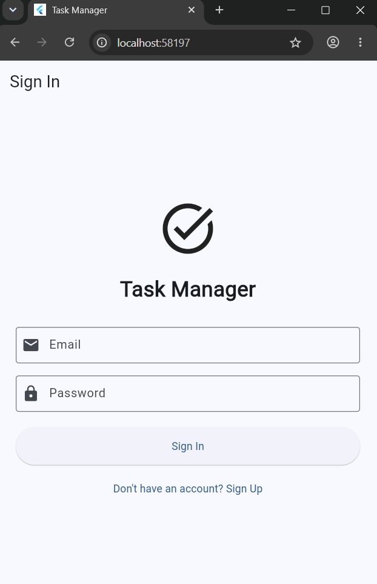
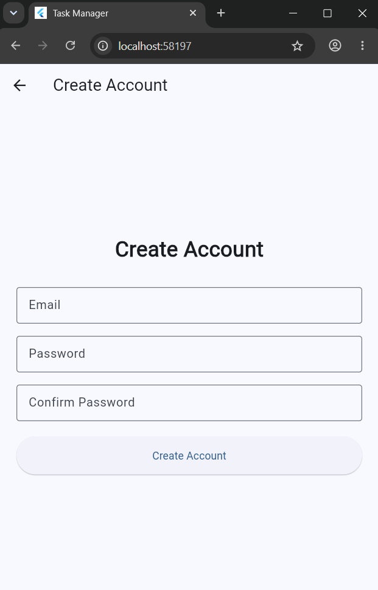
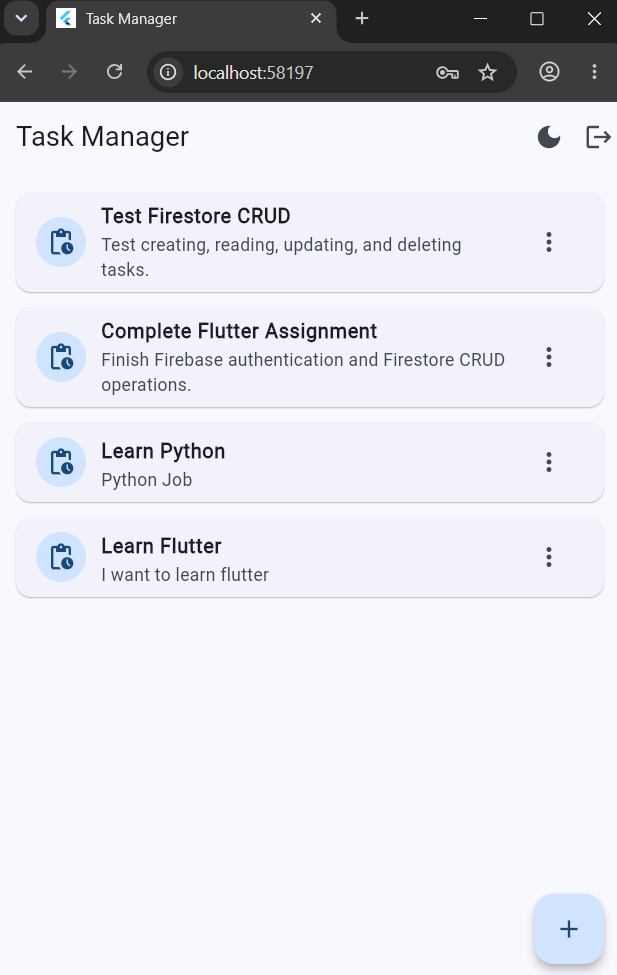
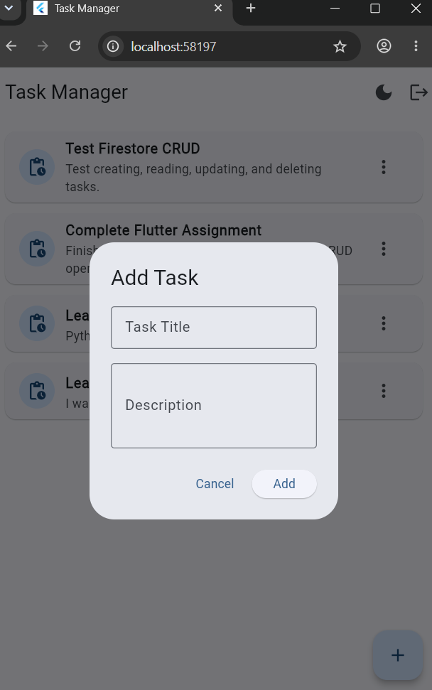
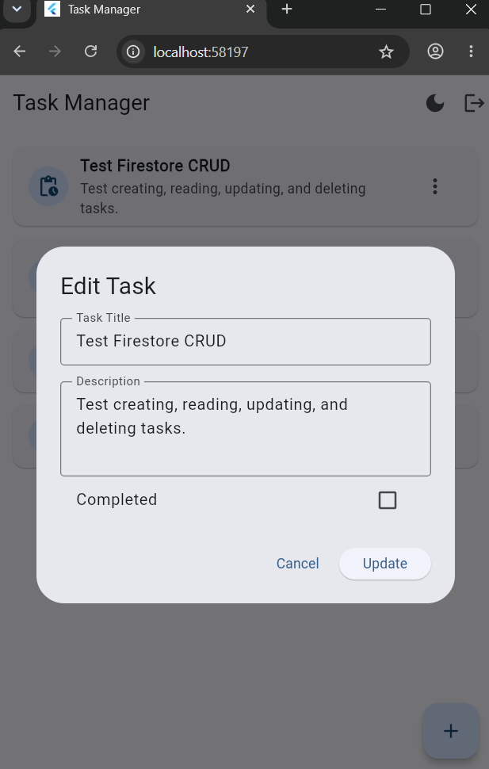
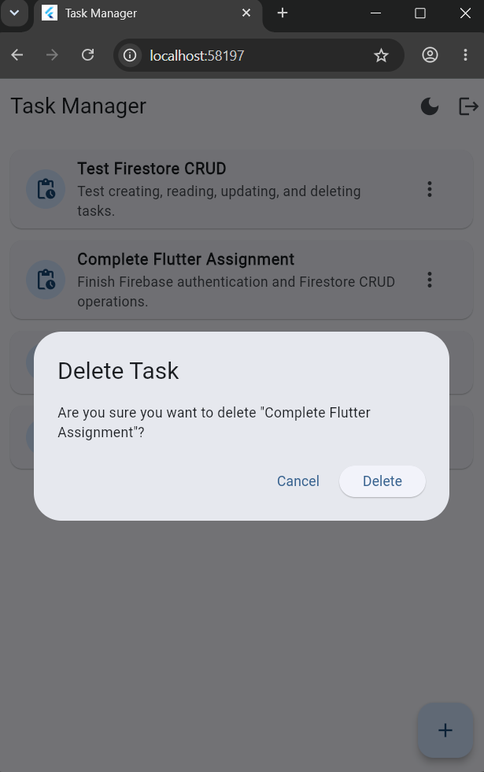
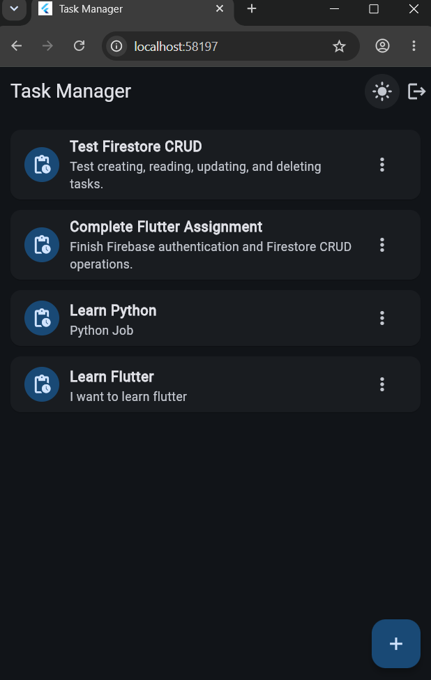
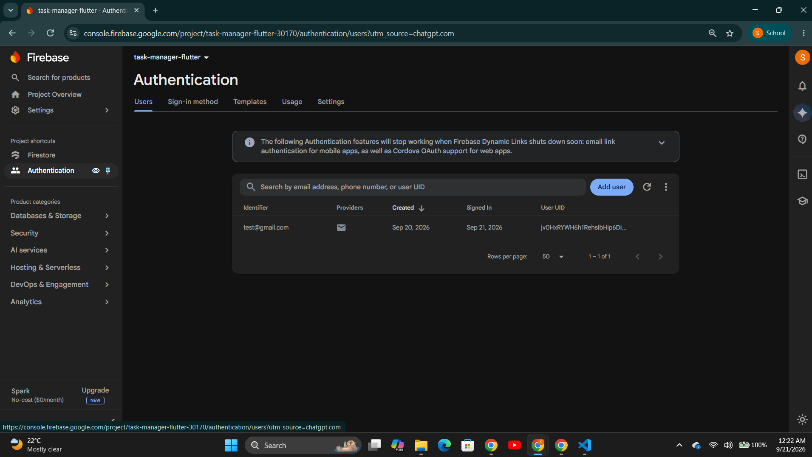
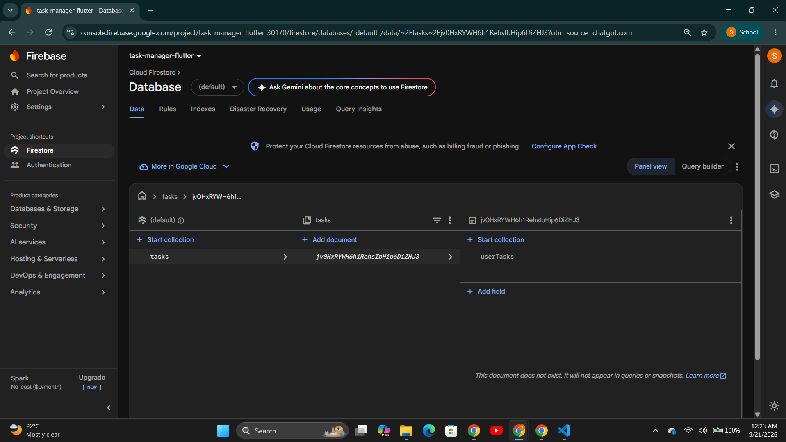

# Task Manager App

A multi-screen Flutter Task Manager application integrated with Firebase Authentication and Cloud Firestore. The application allows authenticated users to create, view, update, and delete their own tasks in real time. It also uses Provider for state management and supports dynamic Light and Dark themes.

---

## 📱 Project Overview

The Task Manager App is a Flutter-based mobile application developed to demonstrate the integration of Flutter with Firebase services.

The application provides user authentication using Firebase Email/Password Authentication and task management using Cloud Firestore. Each user's tasks are associated with their Firebase Authentication UID, allowing users to manage their own task data.

The project also demonstrates the use of Provider for application state management and dynamic Light/Dark mode switching.

---

## ✨ Features

### 🔐 Authentication

* User Sign Up using Email and Password
* User Sign In
* User Sign Out
* Persistent authentication state
* Automatic redirection to the Sign In screen when the user is not authenticated
* Firebase Authentication integration

### ✅ Task Management

* Create new tasks
* View tasks in real time
* Edit existing tasks
* Mark tasks as completed
* Delete tasks
* Delete confirmation dialog
* Tasks linked to the authenticated user's UID
* Cloud Firestore database integration

### 🔄 State Management

* Provider package
* `AuthProvider` for authentication state
* `TaskProvider` for task data and CRUD operations
* `ThemeProvider` for theme management
* Real-time Firestore stream handling

### 🎨 Theme Support

* Custom Light Theme
* Custom Dark Theme
* Dynamic Light/Dark mode toggle
* Theme changes without clearing task data

---

## 🛠 Technologies Used

| Technology              | Purpose                      |
| ----------------------- | ---------------------------- |
| Flutter                 | Mobile application framework |
| Dart                    | Programming language         |
| Firebase Core           | Firebase initialization      |
| Firebase Authentication | User authentication          |
| Cloud Firestore         | Real-time database           |
| Provider                | State management             |
| FlutterFire CLI         | Firebase configuration       |
| Git                     | Version control              |
| GitHub                  | Source code repository       |

---

## 📂 Project Structure

```text
lib/
├── models/
│   └── task_model.dart
│
├── services/
│   ├── auth_service.dart
│   └── task_service.dart
│
├── providers/
│   ├── auth_provider.dart
│   ├── task_provider.dart
│   └── theme_provider.dart
│
├── screens/
│   ├── auth/
│   │   ├── login_screen.dart
│   │   └── signup_screen.dart
│   │
│   └── home/
│       └── home_screen.dart
│
├── firebase_options.dart
└── main.dart
```

---

## 🏗 Application Architecture

The application follows a modular architecture that separates the user interface, state management, business logic, and Firebase operations.

```text
┌─────────────────────────┐
│      User Interface     │
│       Flutter UI        │
└────────────┬────────────┘
             │
             ▼
┌─────────────────────────┐
│       Providers         │
│ AuthProvider            │
│ TaskProvider            │
│ ThemeProvider            │
└────────────┬────────────┘
             │
             ▼
┌─────────────────────────┐
│        Services         │
│ AuthService             │
│ TaskService             │
└────────────┬────────────┘
             │
             ▼
┌─────────────────────────┐
│         Firebase        │
│ Authentication          │
│ Cloud Firestore         │
└─────────────────────────┘
```

This separation keeps database and business operations outside the UI widgets.

---

# 🔐 Firebase Authentication

The application uses **Firebase Authentication with Email/Password**.

### Authentication Flow

```text
User
  ↓
Sign Up / Sign In
  ↓
Firebase Authentication
  ↓
Authenticated User
  ↓
Home Screen
```

The application uses Firebase authentication state changes to determine whether the user should see the Sign In screen or the Home screen.

When the user is signed out, the application automatically returns to the authentication screen.

---

# ☁️ Cloud Firestore

Cloud Firestore is used to store and manage task data.

Tasks are organized using the authenticated user's UID.

```text
tasks/
└── {userId}/
    └── userTasks/
        └── {taskId}
```

Each task contains:

```text
title
description
isCompleted
userId
createdAt
```

---

# 🔄 CRUD Operations

The application implements all four required CRUD operations.

## Create

Users can create a new task by entering a task title and description.

Example:

```text
Task Title:
Complete Flutter Assignment

Description:
Finish Firebase authentication and Firestore CRUD operations.
```

## Read

Tasks are displayed in the application using a real-time Firestore stream.

When Firestore data changes, the task list automatically updates.

## Update

Users can edit:

* Task title
* Task description
* Completion status

## Delete

Users can delete a task through the Delete option.

A confirmation dialog is displayed before the task is removed.

---

# 👤 User-Specific Tasks

Each task is linked to the authenticated Firebase user using their UID.

Example:

```text
User UID
   ↓
tasks/{userId}/userTasks/{taskId}
```

This keeps each user's task data separated from other users.

---

# 🔒 Firestore Security Rules

The application uses user-specific Firestore security rules:

```text
rules_version = '2';

service cloud.firestore {
  match /databases/{database}/documents {

    match /tasks/{userId}/userTasks/{taskId} {
      allow read, write: if request.auth != null
                         && request.auth.uid == userId;
    }
  }
}
```

These rules allow an authenticated user to read and modify tasks stored under their own UID.

---

# 🔄 Provider State Management

The application uses the **Provider** package for state management.

### AuthProvider

Responsible for:

* Current authenticated user
* Sign In
* Sign Up
* Sign Out
* Authentication state

### TaskProvider

Responsible for:

* Task list
* Real-time task stream
* Create task
* Update task
* Delete task
* Task-related errors and loading state

### ThemeProvider

Responsible for:

* Current theme
* Light/Dark switching
* Notifying the UI when the theme changes

---

# 🎨 Light and Dark Mode

The application contains separate Light and Dark `ThemeData` configurations.

Users can switch themes using the theme button in the AppBar.

```text
Light Mode
     ↕
Theme Toggle
     ↕
Dark Mode
```

Changing the theme does not remove the current task data.

---

# 📋 Application Screenshots

The following screenshots demonstrate the main features of the application.

## Sign In



## Sign Up



## Task List



## Add Task



## Edit Task



## Delete Confirmation



## Dark Mode



## Firebase Authentication



## Cloud Firestore



---

# 🔥 Firebase Configuration

## Prerequisites

Before running this project, install:

* Flutter SDK
* Dart SDK
* Android Studio or VS Code
* Git
* Firebase account

Check Flutter installation:

```bash
flutter doctor
```

---

## 1. Clone the Repository

```bash
git clone https://github.com/sumanmagar69/task-manager-app.git
```

Go to the project directory:

```bash
cd task-manager-app
```

---

## 2. Install Flutter Dependencies

```bash
flutter pub get
```

---

## 3. Create a Firebase Project

Open:

https://console.firebase.google.com/

Create a new Firebase project.

---

## 4. Enable Firebase Authentication

In Firebase Console:

```text
Authentication
        ↓
Sign-in method
        ↓
Email/Password
        ↓
Enable
```

Save the changes.

---

## 5. Create Cloud Firestore

In Firebase Console:

```text
Firestore Database
        ↓
Create database
```

Complete the Firebase database setup.

---

## 6. Configure FlutterFire

Install FlutterFire CLI:

```bash
dart pub global activate flutterfire_cli
```

From the project root directory run:

```bash
flutterfire configure
```

Select your Firebase project and required platforms.

This generates:

```text
lib/firebase_options.dart
```

---

## 7. Firebase Initialization

Firebase is initialized in `main.dart`:

```dart
await Firebase.initializeApp(
  options: DefaultFirebaseOptions.currentPlatform,
);
```

---

## 8. Configure Firestore Rules

Open:

```text
Firebase Console
→ Firestore Database
→ Rules
```

Use:

```text
rules_version = '2';

service cloud.firestore {
  match /databases/{database}/documents {

    match /tasks/{userId}/userTasks/{taskId} {
      allow read, write: if request.auth != null
                         && request.auth.uid == userId;
    }
  }
}
```

Publish the rules.

---

# ▶️ Run the Application

Connect an Android emulator or physical Android device.

Check available devices:

```bash
flutter devices
```

Run the application:

```bash
flutter run
```

---

# 🧪 Testing

## Authentication Testing

1. Open the application.
2. Select **Sign Up**.
3. Enter an email and password.
4. Create an account.
5. Sign in.
6. Confirm the Home screen is displayed.
7. Sign out.
8. Sign in again.

## CRUD Testing

### Create

Create a new task with a title and description.

### Read

Confirm that the task appears in the task list.

### Update

Edit the task title or description and save the changes.

### Complete

Open the Edit Task dialog and mark the task as completed.

### Delete

Select Delete and confirm the deletion.

### Firebase Verification

Confirm that the task is created, updated, and deleted in Cloud Firestore.

## Theme Testing

1. Sign in.
2. Create one or more tasks.
3. Toggle Dark Mode.
4. Confirm the interface changes to the Dark Theme.
5. Toggle back to Light Mode.
6. Confirm that the task data remains available.

---

# 📹 Demonstration Video

A short screen recording can demonstrate:

```text
Sign Up
   ↓
Sign In
   ↓
Create Task
   ↓
View Task
   ↓
Edit Task
   ↓
Mark Task Completed
   ↓
Delete Task
   ↓
Light/Dark Mode
   ↓
Sign Out
```

Demo video:

**Add your YouTube or Google Drive video link here.**

---

# ✅ Assignment Requirements

| Requirement               | Implementation                       |
| ------------------------- | ------------------------------------ |
| Firebase Authentication   | Email/Password                       |
| Sign In                   | ✅ Implemented                        |
| Sign Up                   | ✅ Implemented                        |
| Sign Out                  | ✅ Implemented                        |
| Persistent Authentication | ✅ `authStateChanges()`               |
| Database                  | ✅ Cloud Firestore                    |
| Create                    | ✅ Add Task                           |
| Read                      | ✅ Real-time Firestore Stream         |
| Update                    | ✅ Edit Task                          |
| Delete                    | ✅ Delete Confirmation                |
| User UID                  | ✅ Tasks linked to authenticated user |
| State Management          | ✅ Provider                           |
| Auth State                | ✅ AuthProvider                       |
| Task State                | ✅ TaskProvider                       |
| Theme State               | ✅ ThemeProvider                      |
| Light Theme               | ✅ Implemented                        |
| Dark Theme                | ✅ Implemented                        |
| Theme Toggle              | ✅ Implemented                        |
| Modular Structure         | ✅ Implemented                        |
| GitHub Repository         | ✅ Public Repository                  |
| README                    | ✅ Included                           |
| Screenshots               | ✅ Included                           |

---

# 🎯 Learning Outcomes

This project demonstrates practical knowledge of:

* Flutter application development
* Dart programming
* Firebase Authentication
* Cloud Firestore
* Real-time database streams
* CRUD operations
* Provider state management
* Authentication state handling
* Light and Dark themes
* Modular application architecture
* Firestore security rules
* Git and GitHub

---

# 👨‍💻 Author

**Suman Kumar Darlami**

Bachelor of Information Technology (Hons)

---

# 📌 GitHub Repository

[Task Manager App - GitHub](https://github.com/sumanmagar69/task-manager-app)

---

# 📄 Academic Project

This application was developed for academic purposes to demonstrate Flutter, Firebase, state management, CRUD operations, and dynamic theming.
